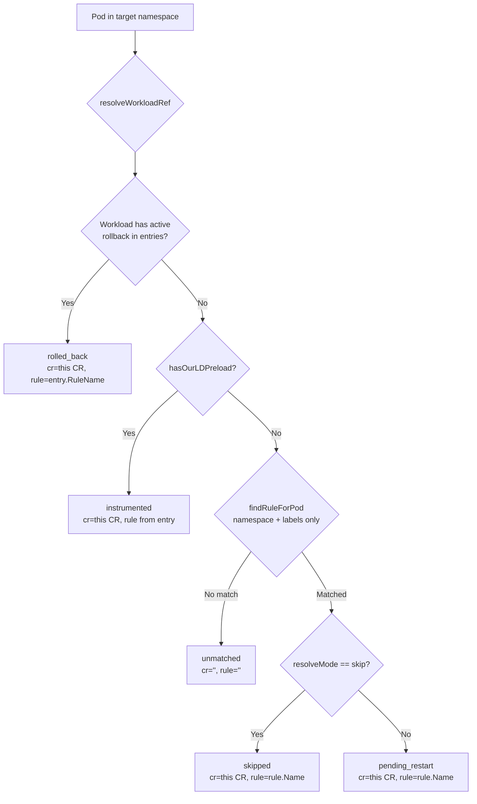

# Instrumentation Status Metrics

After the webhook injects instrumentation into pods, the operator previously had no visibility into the resulting cluster-wide state. This adds a Prometheus-scrapeable metric that answers:

- Which workloads are fully instrumented right now?
- Which matched a rule but haven't been bounced yet?
- Which are explicitly excluded (skipped)?
- Which have been rolled back due to crashes?

## Key decisions

| # | Question | Decision |
|---|----------|----------|
| Q1 | Where does the metric type live? | **`apis/v2alpha1/metrics.go`** — mirrors the pattern in `apis/v1beta1/metrics.go` for collector CR metrics; metric plumbing lives in the API package, classification logic lives in the controller package |
| Q2 | Sync or async (observable)? | **`Int64ObservableUpDownCounter` (async, callback-based)** — avoids stale series when workloads disappear; the callback fires at collection time and reports exactly what is currently known. A sync counter would require explicit −1 calls to clear entries. |
| Q3 | Granularity? | **Per-pod-count, grouped by (namespace, workload_kind, workload_name, CR, rule, status)** — aggregating at the workload level would lose per-namespace breakdown; aggregating at the pod level would produce one series per pod (too noisy). Grouping gives per-workload counts while keeping cardinality manageable. |
| Q4 | Where does the logic run? | **Rollback controller** (`RollbackReconciler`) — it already does a full namespace pod sweep each reconcile, so metrics update is zero additional API calls. The pod cache built by `buildWorkloadInventory` already contains all pods in target namespaces. |
| Q5 | Gate? | **`--enable-cr-metrics`** — matches the existing convention used for collector CR metrics. Defaults to false. |
| Q6 | Metric naming convention? | **OTel dot-notation** (`otel.operator.instrumented.pods`, attribute names like `k8s.namespace.name`) — the Prometheus exporter converts dots to underscores automatically. Attribute names follow OTel semantic conventions where applicable. The existing v1beta1 collector metrics use raw underscore names; this is technically incorrect per spec and we don't repeat that mistake here. |

## Metric schema

**Name:** `otel.operator.instrumented.pods` (→ `otel_operator_instrumented_pods_total` in Prometheus)
**Type:** `Int64ObservableUpDownCounter`
**Unit:** `{pod}`
**Value:** Count of pods in that status

| Attribute | Values |
|-----------|--------|
| `k8s.namespace.name` | pod's namespace |
| `k8s.workload.kind` | `Deployment` / `StatefulSet` / `DaemonSet` / `Job` / `ReplicaSet` / `Pod` (standalone only) |
| `k8s.workload.name` | owner workload name |
| `otel.instrumentation.cr` | Instrumentation CR name (empty string for `unmatched`) |
| `otel.instrumentation.rule` | matched rule name (empty string for `unmatched`) |
| `otel.instrumentation.status` | see below |

**Status values:**

| Status | Meaning |
|--------|---------|
| `instrumented` | Pod has LD_PRELOAD; no active rollback |
| `pending_restart` | Pod matches a non-skip rule but lacks LD_PRELOAD (needs bounce) |
| `rolled_back` | Workload has an active rollback in `status.instrumentedWorkloads` |
| `skipped` | Pod matched a `mode: skip` rule |
| `unmatched` | Pod is in the CR's target namespaces but matched no rule |

## Classification logic

Each pod is classified (first match wins):



**Note on container selectors:** `findRuleForPod` matches on namespace + pod labels only — container-name selectors are ignored for pod-level classification. A pod is classified based on whether any container would receive injection. Known edge case: a `containerNames` rule that targets only a container not present in the pod would still report `pending_restart` at the pod level. This is acceptable since container-name selectors are uncommon.

**Standalone pods** (no recognized owner): classified by the same logic; reported as `k8s.workload.kind=Pod` with `k8s.workload.name=pod.Name`.

## Event coverage

Metrics update event-driven with the rollback controller's existing reconcile triggers — no periodic requeue added.

| Event | Effect |
|-------|--------|
| CR created / updated | reconcile fires → all target namespaces rescanned → full metric update |
| Pod with LD_PRELOAD created or deleted | `isRelevantPod` → reconcile fires → `pending_restart ↔ instrumented` transition captured |
| Crash detected → rollback triggered | existing rollback logic triggers reconcile → `rolled_back` captured |
| CR deleted | `DeleteCR` clears all measurements for that CR |

**Known gap:** A pod whose labels change to start matching a rule (`unmatched → pending_restart`) won't trigger `isRelevantPod`, so metrics for that pod lag until the next CR event. This is an acceptable edge case.

## Scoping

The scan is bounded to the namespaces already in the pod cache — i.e., namespaces covered by at least one rule in the CR. Pods in namespaces entirely outside the CR's scope are not reported.

## Implementation

| Component | File | Role |
|-----------|------|------|
| `InstrumentationMetrics` | `apis/v2alpha1/metrics.go` | Observable counter registration, `UpdateCR`/`DeleteCR`, thread-safe `byCR` map driven by OTel SDK callback |
| `computeStatusCounts` | `internal/injector/metrics.go` | Pure function: iterates pod cache, classifies pods, aggregates counts. Uses package-internal helpers (`hasOurLDPreload`, `resolveWorkloadRef`, `matchesNamespace`, etc.) |
| `findRuleForPod` | `internal/injector/metrics.go` | Rule lookup ignoring container-name selectors |
| `RollbackReconciler` | `internal/injector/rollback_controller.go` | Calls `computeStatusCounts` after each inventory rebuild; calls `DeleteCR` on CR deletion |
| Meter provider bootstrap | `main.go` | Inlined: creates Prometheus exporter on `ctrlmetrics.Registry`, constructs `sdkmetric.MeterProvider`; shared by both collector CR metrics and instrumentation metrics |

## Testing

```bash
# Enable metrics (disable secure serving for local curl)
kubectl patch deployment opentelemetry-operator-controller-manager \
  -n opentelemetry-operator-system --type=json \
  -p='[
    {"op":"add","path":"/spec/template/spec/containers/0/args/-","value":"--enable-cr-metrics=true"},
    {"op":"add","path":"/spec/template/spec/containers/0/args/-","value":"--metrics-secure=false"}
  ]'

kubectl port-forward -n opentelemetry-operator-system \
  deployment/opentelemetry-operator-controller-manager 8443:8443 &

curl -s http://localhost:8443/metrics | grep otel_operator_instrumented_pods
```

See `scratch/test-compatibility-check.md` (Scenario B, steps 3b and 7) for the full sequence including how to observe each status value.
